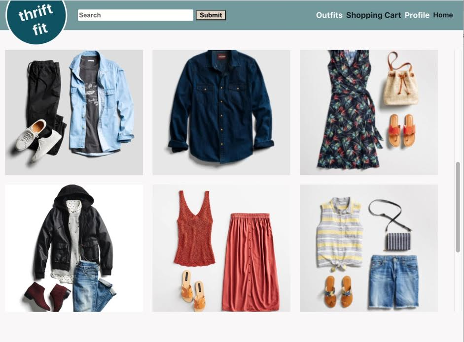

# Thrift-fit

This app is for people to find thrifted outfits that have been curated by various different individuals. The users can explore a large selection of outfits purchasing the ones that they like and following curators who best match their styles and tastes.
 
## Explanation of Technology
- Applied **Node.js and Express** as a server-side web application framework to create and consume our own API.
- **React, CSS, JavaScript** were applied on the front-end with MVC architecture pattern design.
- **Deployed via Heroku** cloud platform including continuous integration with Git.
- Persisted data using **Postgres** and designed tables to guarantee performance and scalability including many to many relationships on the shopping cart join table between users and outfits.
- **PG-PROMISE** was used as an asynchronous operation to retrieve data and consume API.
- Optimized time management with **Kanban project board** as agile development methodology which resulted in 100% of on time tasks implemented throughout the software development Lifecycle.
## Added bonus functionality:
- **Auth** was implemented allowing users to have their own accounts.
- **Third-Party API**: Used ‘Ship Engine’ third-party API that allows us to calculate shipping costs.
 
## Installation instructions
To install and run thrift-fit-locally you need to first run git clone with the project
link. After installing it locally you need to run yarn install in the top-level directory ad well as the client directory. After doing that you need to create a local database you can name it whatever you want we named it thrift_fit. If you name it something other than thrift_fit you need to go into db/config.js and change the database name on line 12. From there you should run your migration files in db/migrations. There is a seed a file in there but it is not necessary to run for the sake of the project. If you do choose to run it please make sure you have at least one user created. You will also need a .env file. The .env file should contain a SECRET_KEY=(INSERT RANDOM STRING).
 
## Wireframes 
 
[Wireframes](./preproduction-materials/wireframes.md)

## ERDS

[Entity Relationship Diagram(ERD)](./Group7ThriftFit.pdf).

## User stories - Moscow Method
  ### Must Have
   - The seller should be able to post outfits that are for sale
   - The seller should be able to view a full list of outfits they have availble
   - The seller should be able to delete outfits after they are sold
   - The seller should be able to see their followers
   - The buyer should be able to follow sellers they like
   - The buyer should be able to see a full list of outfits from all sellers
   - The buyer should be able to see a full list of outfits from all sellers they follow
   - The buyer should be able to see a full list of outfits from one seller they follow
   - The buyer and seller should be able to login
    
  ### Should Have
   - The buyer should be able to see shipping costs
   - The buyer should be able to buy the outfits
    
  ### Could Have
   - The seller should be see their rating
   - The buyer should be able to add friends
   - The buyer should be able to see friends
   - The buyer should be able to recommend an outfit to a friend
   - The buyer should be able to see their recommendations.
    
  ### Will not have
  - The buyer should be able to send a request for a seller to put together an outfit for them.
  - The Seller should have outfits automatically deleted if a user buys one

## Link to deployed app

https://vast-meadow-68893.herokuapp.com/

## Unsolved problems
- Right before the prestentation we found out that when ever our heroku app refreshes the website crashes. We are not sure why this is happening as it does not happen in dev.
